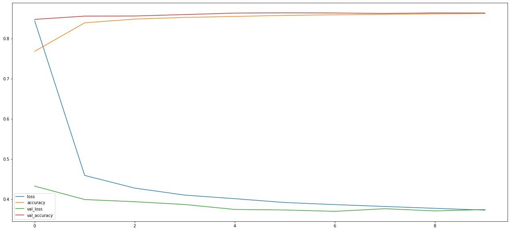

# ANRC (Alpha Numeric Recognition Canvas)

ANRC is an application that allows the user to write anything on a canvas.
The application then tries to predict what is written on the canvas.
However, the application does not predict multiple or non alpha numeric characters written on the canvas.
As it is designed to only predict a single alpha numeric character written on the canvas at a time.

<br/><br/>

## Technical Details

(Technical Details)

<br/><br/>

## Cost History

### 

<br/><br/>

## Confusion Matrix

### 

<br/><br/>

## Classification Report

```
              precision    recall  f1-score   support

           0       0.69      0.77      0.73      2838
           1       0.66      0.95      0.78      3185
           2       0.95      0.97      0.96      2938
           3       0.99      0.99      0.99      2967
           4       0.96      0.98      0.97      2825
           5       0.98      0.89      0.93      2635
           6       0.97      0.98      0.98      2811
           7       0.99      0.99      0.99      3039
           8       0.98      0.98      0.98      2836
           9       0.94      0.97      0.95      2839
          10       0.94      0.97      0.96       522
          11       0.93      0.95      0.94       319
          12       0.75      0.93      0.83       873
          13       0.91      0.90      0.90       402
          14       0.95      0.97      0.96       422
          15       0.78      0.94      0.85       716
          16       0.96      0.87      0.91       228
          17       0.93      0.95      0.94       282
          18       0.69      0.42      0.53      1050
          19       0.85      0.88      0.87       313
          20       0.63      0.72      0.67       189
          21       0.89      0.96      0.92       410
          22       0.76      0.98      0.86       776
          23       0.93      0.97      0.95       706
          24       0.63      0.61      0.62      2137
          25       0.86      0.91      0.89       724
          26       0.92      0.88      0.90       182
          27       0.94      0.98      0.96       390
          28       0.77      0.97      0.86      1733
          29       0.93      0.93      0.93       811
          30       0.76      0.94      0.84      1001
          31       0.63      0.75      0.68       397
          32       0.82      0.80      0.81       387
          33       0.63      0.83      0.72       197
          34       0.82      0.62      0.71       394
          35       0.72      0.54      0.62       250
          36       0.88      0.95      0.91       784
          37       0.93      0.85      0.89       421
          38       0.50      0.02      0.03       242
          39       0.98      0.98      0.98       830
          40       0.97      0.98      0.98      1985
          41       0.51      0.11      0.18       207
          42       0.60      0.64      0.62       296
          43       0.97      0.94      0.95       729
          44       0.59      0.49      0.53       189
          45       0.82      0.62      0.71       149
          46       0.75      0.64      0.69       247
          47       0.53      0.12      0.19      1265
          48       0.12      0.01      0.02       226
          49       0.93      0.95      0.94       981
          50       0.00      0.00      0.00       232
          51       0.60      0.41      0.49       188
          52       0.74      0.42      0.53       230
          53       0.95      0.96      0.96      1154
          54       1.00      0.00      0.01       211
          55       0.95      0.94      0.95      1469
          56       0.47      0.06      0.11       253
          57       0.53      0.32      0.40       256
          58       0.71      0.69      0.70       228
          59       0.78      0.60      0.68       238
          60       0.52      0.56      0.54       198
          61       0.59      0.57      0.58       230

    accuracy                           0.86     58162
   macro avg       0.78      0.73      0.73     58162
weighted avg       0.85      0.86      0.85     58162
```
